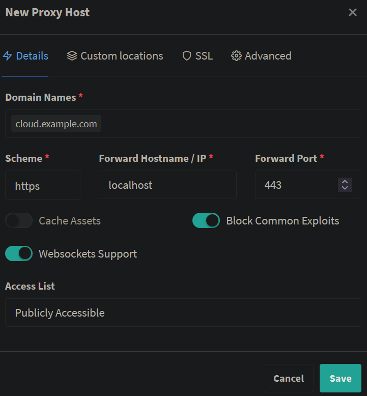
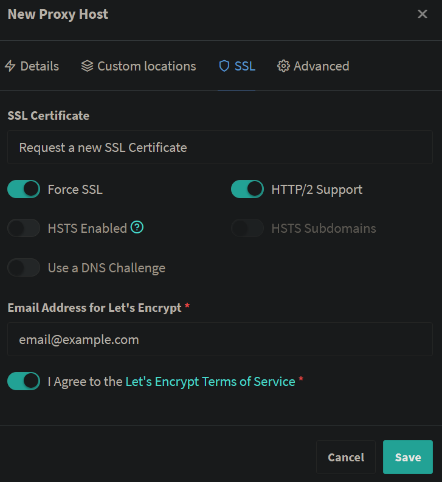
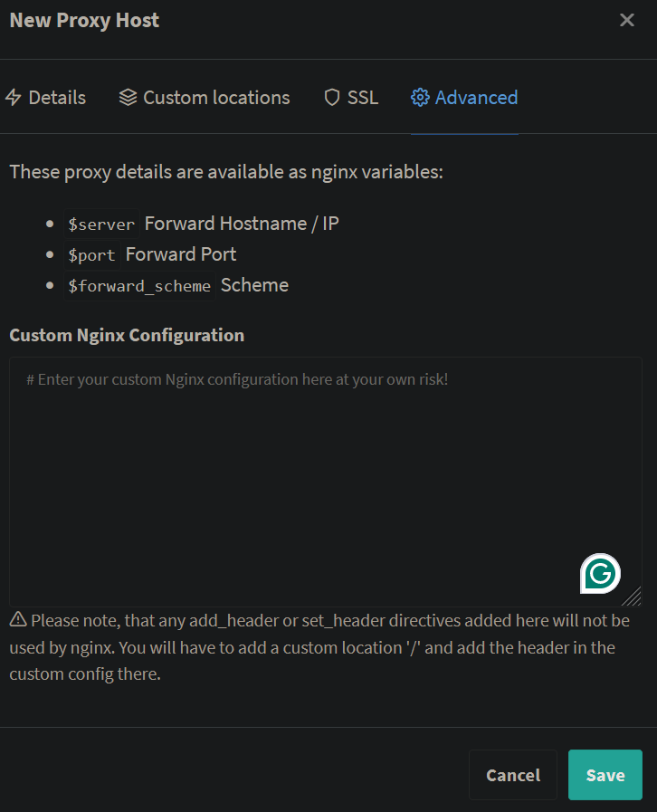
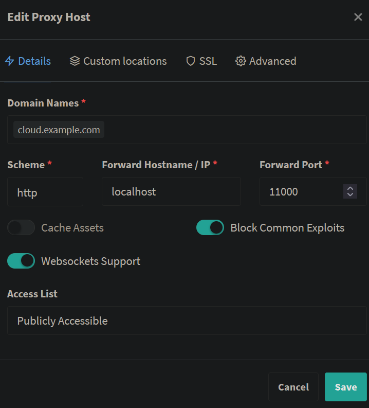
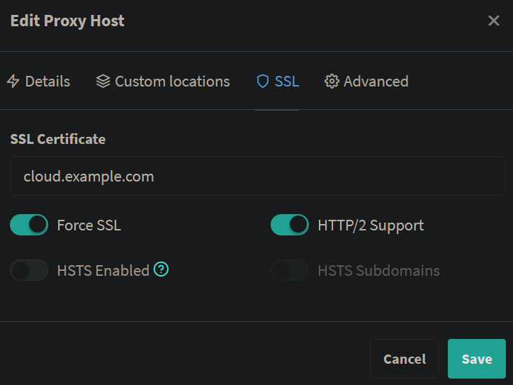
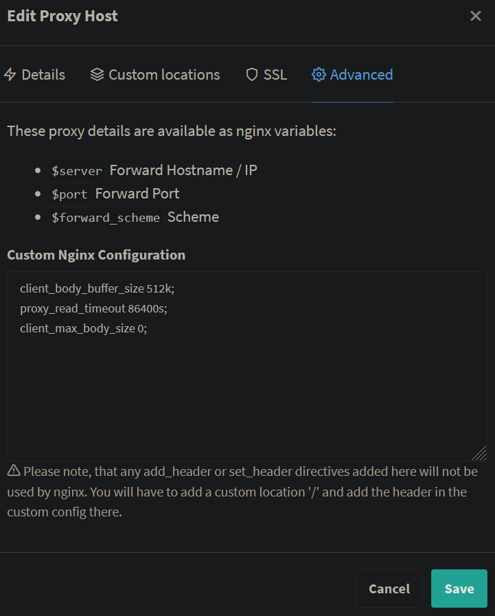

# nextcloud-on-truenas


## 1. Installing Jailmaker

Installing Jailmaker in shell
```bash
cd /mnt/tank/jailmaker
sudo curl --location --remote-name https://raw.githubusercontent.com/Jip-Hop/jailmaker/main/jlmkr.py
sudo chmod +x jlmkr.py
```

Adding jlmkr alias
```bash
echo "alias jlmkr=\"sudo '/mnt/tank/jailmaker/jlmkr.py'\"" >> ~/.zshrc
source ~/.zshrc
```

Jailmaker Init/Startup script

```bash
/mnt/tank/jailmaker/jlmkr.py startup
```

Docker jail template

```bash
startup=1
gpu_passthrough_intel=0
gpu_passthrough_nvidia=0
# Turning off seccomp filtering improves performance at the expense of security
seccomp=1

# Use macvlan networking to provide an isolated network namespace,
# so docker can manage firewall rules
# Alternatively use --network-macvlan=eno1 instead of --network-bridge
# Ensure to change eno1/br1 to the interface name you want to use
# You may want to add additional options here, e.g. bind mounts
systemd_nspawn_user_args=--network-macvlan=enp2s0
    --resolv-conf=bind-host
    --system-call-filter='add_key keyctl bpf'

    --bind='/mnt/tank/docker/stacks:/opt/stacks'
    --bind='/mnt/tank/docker/data:/mnt/data'

    --bind='/mnt/tank/nextcloud/userData:/mnt/nextcloud/userData'
    --bind='/mnt/tank/nextcloud/mount:/mnt/nextcloud/mount'
    --bind='/mnt/tank/nextcloud/config:/mnt/docker-aio-config'

# Script to run on the HOST before starting the jail
# Load kernel module and config kernel settings required for docker
pre_start_hook=#!/usr/bin/bash
    set -euo pipefail
    echo 'PRE_START_HOOK'
    echo 1 > /proc/sys/net/ipv4/ip_forward
    modprobe br_netfilter
    echo 1 > /proc/sys/net/bridge/bridge-nf-call-iptables
    echo 1 > /proc/sys/net/bridge/bridge-nf-call-ip6tables

# Only used while creating the jail
distro=debian
release=bookworm

# Install docker inside the jail:
# https://docs.docker.com/engine/install/debian/#install-using-the-repository
# Will also install the NVIDIA Container Toolkit if gpu_passthrough_nvidia=1 during initial setup
# https://docs.nvidia.com/datacenter/cloud-native/container-toolkit/latest/install-guide.html
initial_setup=#!/usr/bin/bash
    set -euo pipefail

    apt-get update && apt-get -y install ca-certificates curl
    install -m 0755 -d /etc/apt/keyrings
    curl -fsSL https://download.docker.com/linux/debian/gpg -o /etc/apt/keyrings/docker.asc
    chmod a+r /etc/apt/keyrings/docker.asc

    echo \
    "deb [arch=$(dpkg --print-architecture) signed-by=/etc/apt/keyrings/docker.asc] https://download.docker.com/linux/debian \
    $(. /etc/os-release && echo "$VERSION_CODENAME") stable" | \
    tee /etc/apt/sources.list.d/docker.list > /dev/null
    
    apt-get update
    apt-get install -y docker-ce docker-ce-cli containerd.io docker-buildx-plugin docker-compose-plugin
    
    # The /usr/bin/nvidia-smi will be present when gpu_passthrough_nvidia=1
    if [ -f /usr/bin/nvidia-smi ]; then
        curl -fsSL https://nvidia.github.io/libnvidia-container/gpgkey -o /etc/apt/keyrings/nvidia.asc
        chmod a+r /etc/apt/keyrings/nvidia.asc
        curl -s -L https://nvidia.github.io/libnvidia-container/stable/deb/nvidia-container-toolkit.list | \
        sed 's#deb https://#deb [signed-by=/etc/apt/keyrings/nvidia.asc] https://#g' | \
        tee /etc/apt/sources.list.d/nvidia-container-toolkit.list

        apt-get update
        apt-get install -y nvidia-container-toolkit

        nvidia-ctk runtime configure --runtime=docker
        systemctl restart docker
    fi

    docker info

# You generally will not need to change the options below
systemd_run_default_args=--property=KillMode=mixed
    --property=Type=notify
    --property=RestartForceExitStatus=133
    --property=SuccessExitStatus=133
    --property=Delegate=yes
    --property=TasksMax=infinity
    --collect
    --setenv=SYSTEMD_NSPAWN_LOCK=0

systemd_nspawn_default_args=--keep-unit
    --quiet
    --boot
    --bind-ro=/sys/module
    --inaccessible=/sys/module/apparmor
```

## 2. Installing Dockge

Installing Dockge in the docker's jail
```bash
# Create directories that store your stacks and stores Dockge's stack
mkdir -p /opt/stacks /opt/dockge
cd /opt/dockge

# Download the compose.yaml
curl https://raw.githubusercontent.com/louislam/dockge/master/compose.yaml --output compose.yaml

# Start the server
docker compose up -d
```

## 3. Installing cloudflare ddns

Create a cloudflare token with permissions:
https://dash.cloudflare.com/profile/api-tokens

- Zone - Zone Settings - Read
- Zone - Zone - Read
- Zone - DNS - Edit

Docker Compose file:
```yaml
version: '2'
services:
  cloudflare-ddns:
    image: oznu/cloudflare-ddns:latest
    restart: always
    environment:
      - API_KEY=xxxxxxx
      - ZONE=example.com
      - SUBDOMAIN=subdomain
      - PROXIED=false
```


## 4. Installing Nginx Proxy Manager

Docker Compose file:
```yaml
version: '3.8'
services:
  npm:
    image: 'jc21/nginx-proxy-manager:latest'
    restart: unless-stopped
    ports:
      # These ports are in format <host-port>:<container-port>
      - '80:80' # Public HTTP Port
      - '443:443' # Public HTTPS Port
      - '81:81' # Admin Web Port
    network_mode: host

    volumes:
      - /mnt/data/npm/data:/data
      - /mnt/data/npm/letsencrypt:/etc/letsencrypt
```

Default username & password:

```
admin@example.com
changeme
```

Obtaining SSL:





## 5. Installing nextcloud aio

Docker Compose file:
```yaml
services:
  nextcloud-aio-mastercontainer:
    image: nextcloud/all-in-one:latest
    init: true
    restart: always
    container_name: nextcloud-aio-mastercontainer # This line is not allowed to be changed as otherwise AIO will not work correctly
    volumes:
      - nextcloud_aio_mastercontainer:/mnt/docker-aio-config # This line is not allowed to be changed as otherwise the built-in backup solution will not work
      - /var/run/docker.sock:/var/run/docker.sock:ro # May be changed on macOS, Windows or docker rootless. See the applicable documentation. If adjusting, don't forget to also set 'WATCHTOWER_DOCKER_SOCKET_PATH'!
    ports:
      #- 80:80 # Can be removed when running behind a web server or reverse proxy (like Apache, Nginx, Cloudflare Tunnel and else). See https://github.com/nextcloud/all-in-one/blob/main/reverse-proxy.md
      - 8080:8080
      #- 8443:8443 # Can be removed when running behind a web server or reverse proxy (like Apache, Nginx, Cloudflare Tunnel and else). See https://github.com/nextcloud/all-in-one/blob/main/reverse-proxy.md
    environment: # Is needed when using any of the options below
      APACHE_PORT: 11000 # Is needed when running behind a web server or reverse proxy (like Apache, Nginx, Cloudflare Tunnel and else). See https://github.com/nextcloud/all-in-one/blob/main/reverse-proxy.md
      APACHE_IP_BINDING: 0.0.0.0 # Should be set when running behind a web server or reverse proxy (like Apache, Nginx, Cloudflare Tunnel and else) that is running on the same host. See https://github.com/nextcloud/all-in-one/blob/main/reverse-proxy.md
      # BORG_RETENTION_POLICY: --keep-within=7d --keep-weekly=4 --keep-monthly=6 # Allows to adjust borgs retention policy. See https://github.com/nextcloud/all-in-one#how-to-adjust-borgs-retention-policyall-in-one#how-to-disable-collaboras-seccomp-feature
      NEXTCLOUD_DATADIR: /mnt/nextcloud/userData # Allows to set the host directory for Nextcloud's datadir. ⚠️⚠️⚠️ Warning: do not set or adjust this value after the initial Nextcloud installation is done! See https://github.com/nextcloud/all-in-one#how-to-change-the-default-location-of-nextclouds-datadir
      NEXTCLOUD_MOUNT: /mnt/nextcloud/mount # Allows the Nextcloud container to access the chosen directory on the host. See https://github.com/nextcloud/all-in-one#how-to-allow-the-nextcloud-container-to-access-directories-on-the-host
      NEXTCLOUD_UPLOAD_LIMIT: 50G # Can be adjusted if you need more. See https://github.com/nextcloud/all-in-one#how-to-adjust-the-upload-limit-for-nextcloud
      # NEXTCLOUD_MAX_TIME: 3600 # Can be adjusted if you need more. See https://github.com/nextcloud/all-in-one#how-to-adjust-the-max-execution-time-for-nextcloud
      NEXTCLOUD_STARTUP_APPS: drawio recognize memories camerarawpreviews -deck -twofactor_totp tasks calendar contacts notes # Allows to modify the Nextcloud apps that are installed on starting AIO the first time. See https://github.com/nextcloud/all-in-one#how-to-change-the-nextcloud-apps-that-are-installed-on-the-first-startup
      # NEXTCLOUD_KEEP_DISABLED_APPS: false # Setting this to true will keep Nextcloud apps that are disabled in the AIO interface and not uninstall them if they should be installed. See https://github.com/nextcloud/all-in-one#how-to-keep-disabled-apps
      # TALK_PORT: 3478 # This allows to adjust the port that the talk container is using. See https://github.com/nextcloud/all-in-one#how-to-adjust-the-talk-port

volumes: # If you want to store the data on a different drive, see https://github.com/nextcloud/all-in-one#how-to-store-the-filesinstallation-on-a-separate-drive
  nextcloud_aio_mastercontainer:
    name: nextcloud_aio_mastercontainer # This line is not allowed to be changed as otherwise the built-in backup solution will not work
```

Nginx Proxy Manager configs:



```
client_body_buffer_size 512k;
proxy_read_timeout 86400s;
client_max_body_size 0;
```